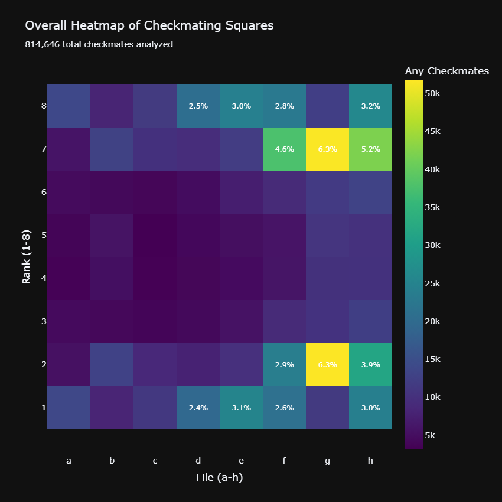
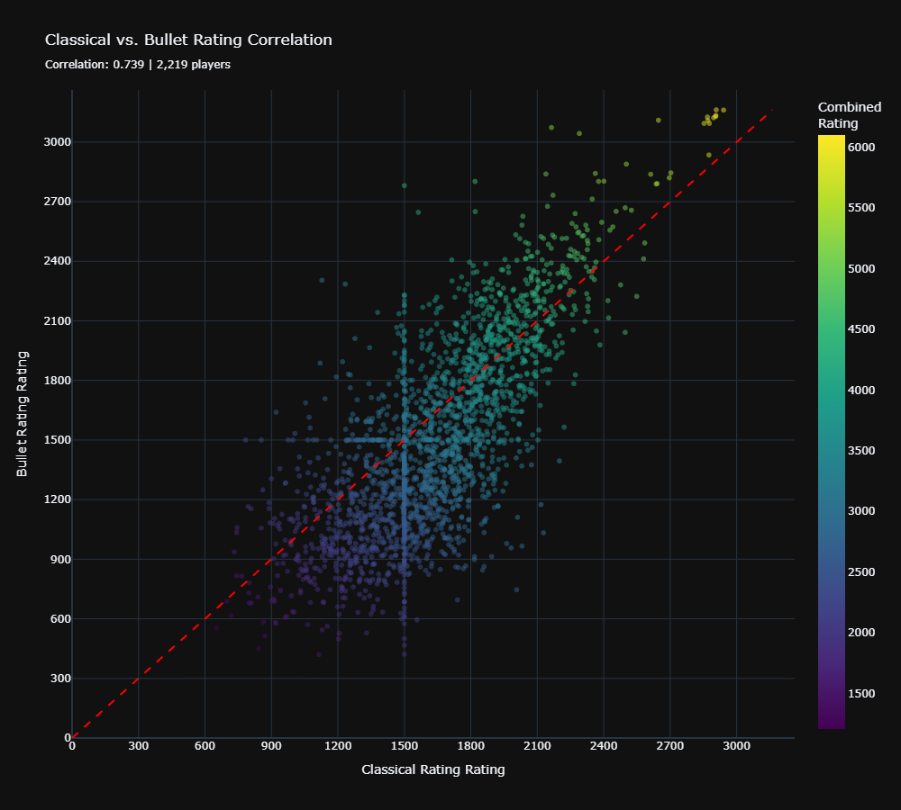
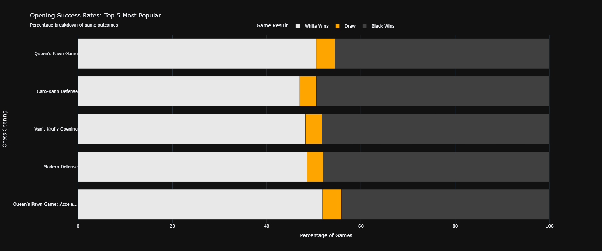
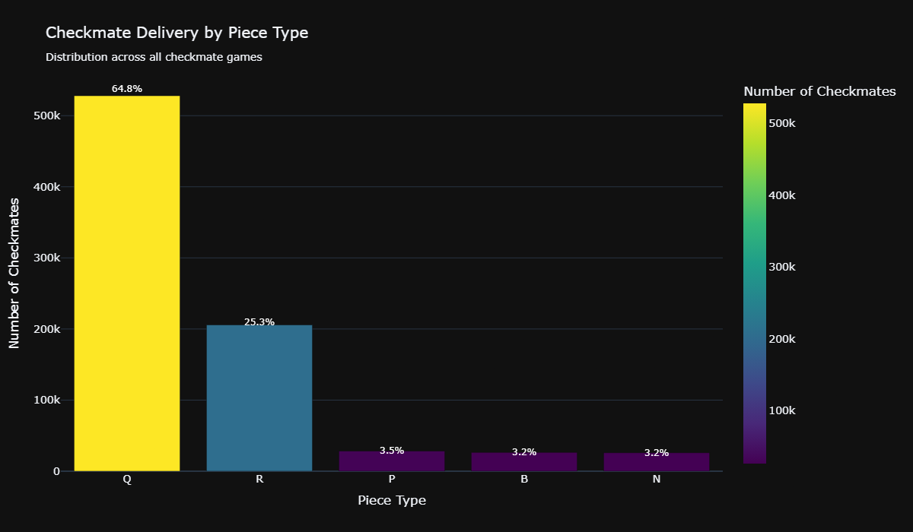
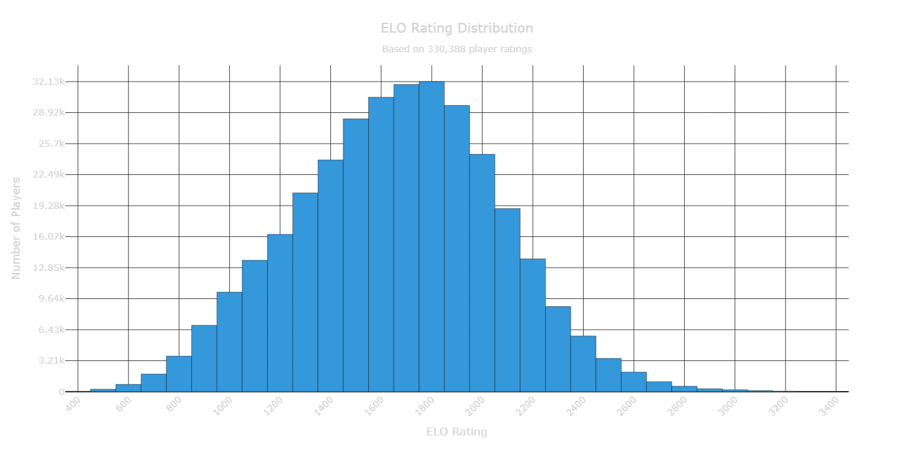

# PySpark Chess Analysis

Analyze large-scale chess games using **PySpark**. This project processes PGN datasets, extracts useful insights, and generates meaningful visualizations.

---

## 📊 Visualizations

### Overall Heatmap of Checkmating Squares



### Scatter Plot: Bullet vs Classical



### Opening Success Rate



### Square Where King Delivers Checkmates


### Histogram of Checkmates by Piece



### Distribution of Ratings



---

## 📁 Project Structure

```
chess_project/
├── images/
│   ├── Overall_Heatmap_of_Checkmating_Squares.png
│   ├── scatter_plot_bullet_vs_classical.png
│   ├── opening_success_rate.png
│   ├── square_where_king_delivers_checkmates.png
│   ├── histogram_of_checkmates_by_piece.png
│   └── distribution_of_ratings.png
├── data/
├── processed/
├── 1_download.ipynb
├── 2_decompress.ipynb
├── 3_process_parititon.ipynb
├── 4_moves_partition.ipynb
├── 5_visualizations.ipynb
├── requirements.txt
└── README.md
```

---

## 🛠 Tech Stack

* **Python 3.x**
* **PySpark**
* **Pandas, NumPy**
* **Plotly, Matplotlib, Seaborn**
* **Rich, Psutil, Zstandard**

---

## 🚀 Setup & Usage

### Linux / macOS (recommended)

```bash
# Clone the repo
git clone git@github.com:YDJ00/pyspark-chess-analysis.git
cd pyspark-chess-analysis

# Create and activate venv
python3 -m venv .venv
source .venv/bin/activate

# Install dependencies
pip install -r requirements.txt

# Ensure Java & Spark are installed
java -version
spark-submit --version
```

### Windows Users (via WSL + Ubuntu)

This project works best in Linux. On Windows, follow these steps:

1. Install **Windows Subsystem for Linux (WSL)** from the Microsoft Store.
2. Install **Ubuntu 22.04** inside WSL.
3. Open Ubuntu terminal and follow the Linux setup steps above.
4. Verify installation:

   ```bash
   java -version
   spark-submit --version
   ```

### Running the project

Run the notebooks in order:

1. `1_download.ipynb`
2. `2_decompress.ipynb`
3. `3_process_parititon.ipynb`
4. `4_moves_partition.ipynb`
5. `5_visualizations.ipynb`

---

## 📬 Contact

**Author:** Yash Jadhav
**GitHub:** [YDJ00](https://github.com/YDJ00)
**Email:** [yash918jadhav@gmail.com](mailto:yash918jadhav@gmail.com)
